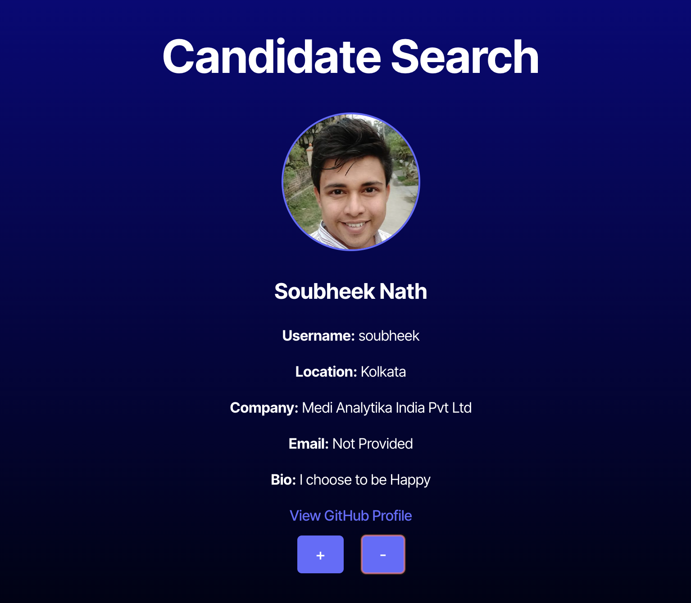
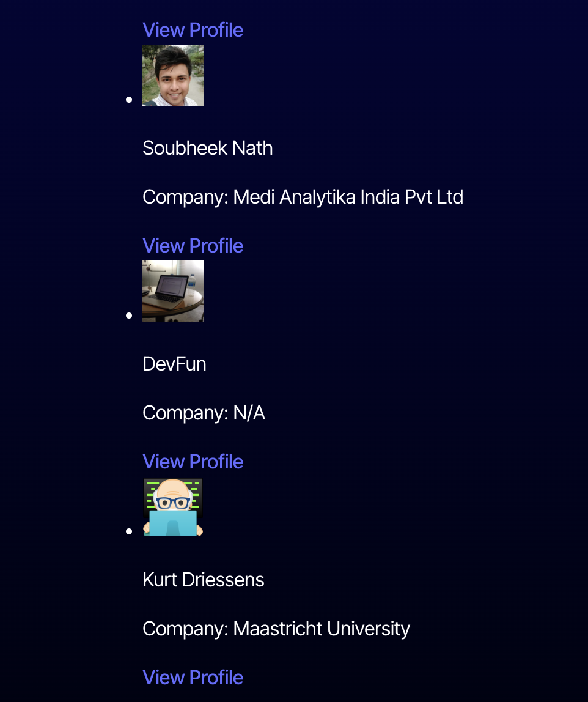

# Candidate Search

## Usage

Candidate search is a straightforward browser-based app that culls user data using the GitHub API and allows employers to screen prospective clients. Using local storage, users can "save" candidates by clicking the plus icon, or skip candidate and move onto the next user by clicking the minus icon.

Saved candidates then appear in the "Saved Candidates" section of the page, displayed alongside some additional identifying information.

A basic navigation bar at the top of the page allows users to bounce back and forth between the two pages. Note that saved users don't disappear when navigating back to the candidate search page. There is also a feature that allows employers to screen candidates by company.

## Contributing

By Morgan Troper. Code sourced from ChatGPT.

## License

[MIT](https://choosealicense.com/licenses/mit/)
